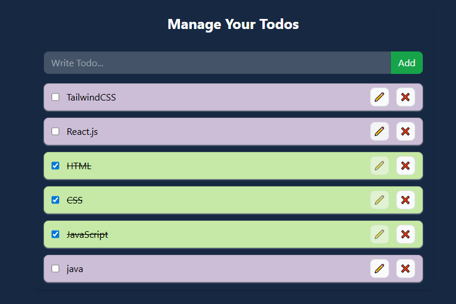

# React + Vite

This template provides a minimal setup to get React working in Vite with HMR and some ESLint rules.

Currently, two official plugins are available:

- [@vitejs/plugin-react](https://github.com/vitejs/vite-plugin-react/blob/main/packages/plugin-react/README.md) uses [Babel](https://babeljs.io/) for Fast Refresh
- [@vitejs/plugin-react-swc](https://github.com/vitejs/vite-plugin-react-swc) uses [SWC](https://swc.rs/) for Fast Refresh


# React Todo App with LocalStorage

A minimal and responsive Todo application built with React and Vite, using Local Storage to persist todos.

## Live Demo  
[Check it out here](https://goals-context.netlify.app/)

## Features
- Add, edit, and delete todos.
- Todos are saved in browser storage—no backend needed.
- Fully responsive layout.

## Tech Stack
- React.js (Vite)
- TailwindCSS
- Local Storage

## Usage
1. Clone the repo  
2. Install dependencies:
   ```bash
   npm install
